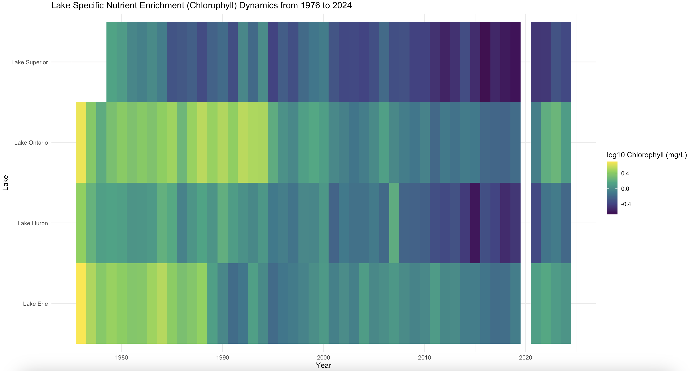

Assignment 3

The first image for the averaged trends across all lakes.

Answering the questions

1. What software did you use to create your data visualization?
This graph was created with R code, with Rstudio.

2. Who is your intended audience?
The intended audience can be policy makers or general publics.

3. What information or message are you trying to convey with your visualization?
The main message is that Ontario's major lakes have distinct, relatively stable neutrient identities, indicating a strong spatial heterogeneity (instead of uniform pattern) across lakes. Besides, the overall color from warmer to colder indicates a long-term decline in neutrient(despite some modest improvement in certain lakes recently), consistent with the pattern revealed in the first visualization.

4. What aspects of design did you consider when making your visualization? How did you apply them? With what elements of your plots?
This visualization is designed to highlight the distinct nutrient profiles of different lakes and the spatial heterogeneity of lakes across Ontario. Because temporal dynamics are not the primary focus, a heatmap was chosen instead of a multi-line graph, as it conveys the main patterns more clearly and visually. To avoid unintended emphasis from color choices, non-salient colors were selected, with warmer tones used to indicate higher nutrient levels. A numeric legend was placed on the right of the heatmap to facilitate quantitative interpretation of the patterns.

5. How did you ensure that your data visualizations are reproducible? If the tool you used to make your data visualization is not reproducible, how will this impact your data visualization?
Same to the first visualization. Neither the data nor my graph production procedure involves randomizations, so it should be reproducible as long as the people use the same dataset and my code.

6. How did you ensure that your data visualization is accessible?
Since the intended audience of this graph includes general public, it does not include any stats or academic term. The title was also more straightforward and message-conveying. 

7. Who are the individuals and communities who might be impacted by your visualization?
This graph highlights the distinct nutrient profiles of individual lakes, which may be of interest to water companies when evaluating potential water sources for their products. It also demonstrates substantial geographic variation in lake nutrient levels across Ontario. Investigating how nutrient concentrations relate to geographic factors—and identifying the drivers of these patterns—could help environmental agencies develop more targeted and effective strategies to improve water quality in different regions.

8. How did you choose which features of your chosen dataset to include or exclude from your visualization?
What ‘underwater labour’ contributed to your final data visualization product?
This graph continues to use chlorophyll as a representative indicator of water nutrients. Log₁₀-transformed values, rather than raw concentrations, were displayed to improve visual interpretability. The transformation reduces the influence of extreme values, allowing variation across both low- and high-concentration lakes to be represented more evenly and preventing highly nutrient-rich lakes from dominating the color scale.
